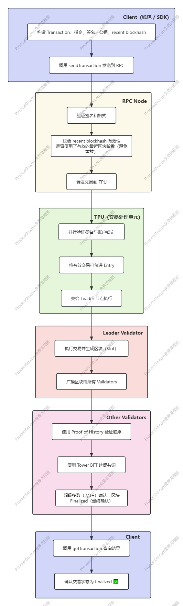
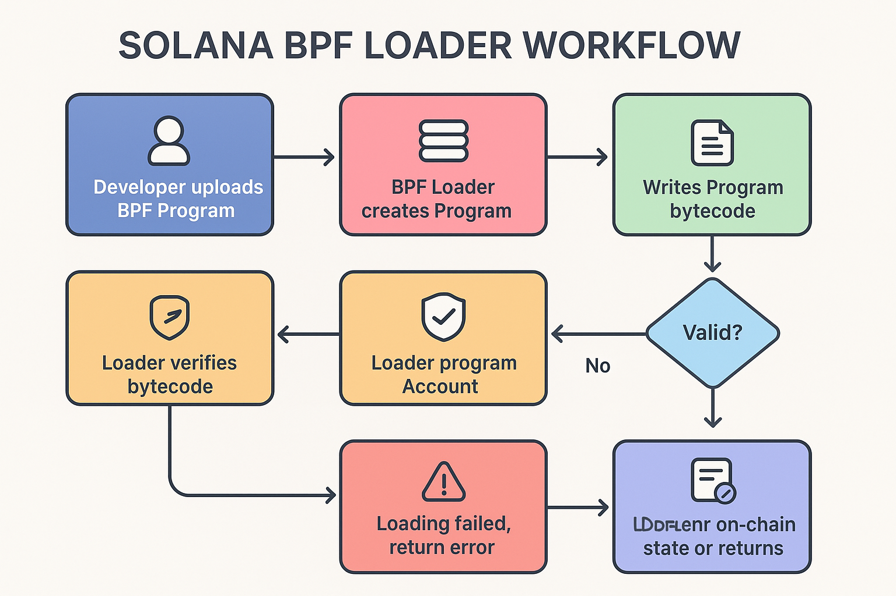
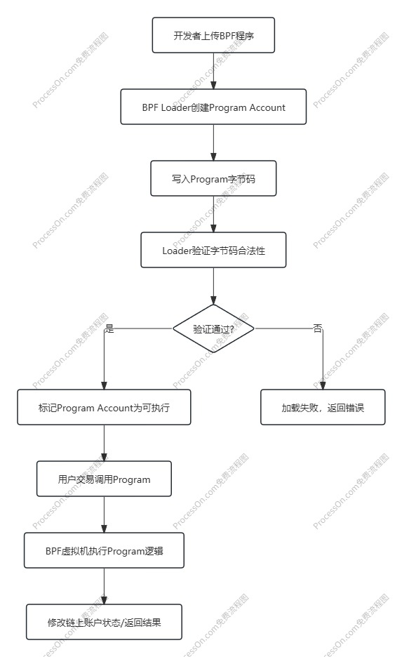

# Solana

在 Solana 中，智能合约叫 **Program**，它是部署在链上的可执行代码。

## Solana 生命周期阶段说明

1. **客户端创建交易（Client → RPC）**
   - 开发者或用户在客户端（钱包、DApp、SDK等）中构造 `Transaction` 对象。
   - 包含：指令（instructions）、签名者、公钥、最近区块哈希（recent blockhash）等信息。
   - 对交易进行签名后，调用 Solana JSON-RPC 的 `sendTransaction` 或 `sendRawTransaction` 接口发送到集群。
2. **RPC 节点接收与初步验证**
   - Solana RPC Node 接收交易，进行格式校验和签名校验。
   - 检查交易是否使用了有效的最近区块哈希（避免重放）。
   - 验证通过后，将交易转发到 Solana TPU (Transaction Processing Unit)。
3. **TPU（交易处理单元）打包与广播**
   - TPU 从 leader 节点的入口队列接收交易。
   - 对交易进行并行签名验证、账户锁定。
   - 将有效交易打包（pack）进一个 Block（Slot）中。
4. **Leader 节点产出区块（Block Production）**
   - 当前 slot 的 leader 节点执行交易，生成区块。
   - 将区块结果广播给其他验证节点（Validators）。
5. **Validators 验证与确认（Consensus）**
   - 其他验证者通过 Proof of History (PoH) 和 Tower BFT 共识机制验证区块。
   - 一旦达到超级多数（2/3+）确认，区块被视为 finalized（最终确认）。
6. **交易状态更新与可查询**
   - 交易结果写入账本状态（Accounts state）。
   - 客户端可通过 `getTransaction` / `getConfirmedTransaction` 等 RPC 查询交易状态。
   - 直到区块被最终确认，交易才算不可逆。

## 📌 状态层级（确认等级）

| 确认等级  | 说明                           |
| --------- | ------------------------------ |
| processed | 节点已处理，但未确定包含进区块 |
| confirmed | 已被少数节点确认包含在区块中   |
| finalized | 超级多数节点已确认，不可逆     |

## BPF 加载器（BPF Loader）

Solana 使用 **BPF（Berkeley Packet Filter）虚拟机** 执行 Program，这意味着 Program 必须被编译为 **BPF 字节码**，然后才能被链上的 **BPF Loader** 加载和执行。

BPF Loader 就是 Solana 系统中负责 **管理、验证和执行 BPF Program 的核心组件**。

### BPF Loader 的作用

BPF Loader 可以理解为三个角色合体：

1. **账户管理者（Account Manager）**
   - Solana 的每个 Program 都绑定一个 **Program Account**。
   - Loader 负责为 Program 分配账户空间，存储 Program 的字节码和状态数据。
2. **验证器（Verifier）**
   - Loader 会检查上传的 BPF 字节码是否符合安全规则，例如不越界访问、不非法调用 Solana 系统接口等。
3. **执行者（Executor）**
   - Loader 会在交易中调用 Program，并通过 **BPF 虚拟机**执行程序逻辑。

### BPF Loader 的工作流程

1. **上传 Program**
   - 开发者通过客户端（CLI 或 SDK）将 BPF 编译后的 Program 上传到 Solana 链。
   - 上传的过程实际上是往一个新的 **Program Account** 写入数据。

2. **分配 Program Account**
   - Loader 创建一个账户（Program Account）用来存储程序。
   - 分配账户空间要大于等于 Program 字节码大小。
   - 初始状态：账户 **不可执行**。

3. **写入 Program 数据**
   - Loader 将 Program 字节码写入 Program Account 的数据区。
   - 数据可以分多次写入，通常通过 `write` 指令完成。

4. **验证 Program**
   - Loader 会对写入的字节码执行一系列 **安全验证**：
     - 是否是有效 BPF 字节码
     - 是否调用了允许的系统接口
     - 是否超出账户内存边界
   - 如果验证失败，程序加载会被拒绝。

5. **标记 Program 可执行**
   - 验证通过后，Loader 将 Program Account 的状态标记为 **Executable**。
   - 此时，账户中存储的 Program 可以被交易调用。

6. **调用和执行**
   - 当用户发起调用交易时：
     - Loader 会在 **BPF 虚拟机**中执行 Program。
     - Program 可以读取和修改 Account 数据（受 Solana 权限控制）。
     - 执行结果会反映在链上状态中。

## 账户存储模型对比（Solana vs EVM）

### 1️⃣ 账户类型

| 特性       | Solana                                               | EVM (Ethereum)                                               |
| ---------- | ---------------------------------------------------- | ------------------------------------------------------------ |
| 账户数量   | 两类：**System Accounts** 和 **Program Accounts**    | 单一账户体系：**Externally Owned Account (EOA)** 与 **Contract Account** |
| 账户标识   | PublicKey（32 字节）                                 | 20 字节地址（EOA/Contract）                                  |
| 存储权限   | 账户有独立数据空间，Program 不能随意修改其他账户数据 | 合约只能修改自己账户存储（其他账户余额可通过调用改变）       |
| 数据持久化 | 账户数据存储在链上，类似数据库，大小固定或可扩展     | 合约有 **storage**（持久化）和 **memory/stack**（临时）      |

### 2️⃣ 数据结构

| 特性     | Solana                                                       | EVM                                                    |
| -------- | ------------------------------------------------------------ | ------------------------------------------------------ |
| 存储单位 | 每个账户有一块独立的 **data buffer**，可自定义结构（可序列化 Rust/Anchor 结构体） | 合约存储是 **key-value mapping**，用 256-bit slot 索引 |
| 内存访问 | 通过 PDA（Program Derived Address）或账户地址访问            | 通过 `storage[key]` 或调用其他合约访问                 |
| 数据大小 | 账户在创建时需预分配大小，超出需额外创建                     | 每个 slot 固定 32 字节，可用 mapping/array 模拟扩展    |
| 可组合性 | 多账户组合交易，通过 CPI（Cross-Program Invocation）访问     | 调用其他合约存储（message call），gas 按调用计费       |

### 3️⃣ 存储与资源计费

| 特性       | Solana                                                       | EVM                                               |
| ---------- | ------------------------------------------------------------ | ------------------------------------------------- |
| 存储成本   | 按 **账户大小** 一次性收取 **租金（rent）**，可通过支付免租金 | 按 **写入 storage 的字节数** 支付 gas（逐笔消耗） |
| 内存临时性 | 程序运行时可申请临时账户或数据 buffer                        | memory 是临时的，transaction 完毕即释放           |
| 费用优化   | 用户可选择关闭 rent，通过保留账户长期存储                    | EVM 需要优化 storage 写入，减少 gas               |

### 4️⃣ 访问与并发

| 特性     | Solana                                                       | EVM                                                   |
| -------- | ------------------------------------------------------------ | ----------------------------------------------------- |
| 并发执行 | 通过 **账户锁（account locking）** 实现并行交易，只要交易账户不冲突 | EVM 串行执行交易，状态全局更新（没有并发）            |
| 访问限制 | 每个 transaction 必须显式声明所有涉及的账户                  | 调用合约时可访问全局状态，但只能通过 EVM 指令限制访问 |
| 可组合性 | CPI 调用其他程序，跨账户访问明确                             | 调用其他合约或调用 msg.sender 进行权限检查            |

### 5️⃣ 权限与安全

| 特性         | Solana                                                  | EVM                                            |
| ------------ | ------------------------------------------------------- | ---------------------------------------------- |
| 账户控制     | Program 账户可写入自己数据，用户签名控制 System Account | EOA 控制自己的账户，合约只能修改自身存储       |
| 数据不可变性 | Program 可以部署不可变逻辑或升级（Anchor 升级机制）     | 合约可通过代理模式升级，默认不可变             |
| 权限细粒度   | PDA 可提供细粒度权限控制                                | 通过 `require(msg.sender == owner)` 等逻辑实现 |

### 6️⃣ 总结对比

| 特点     | Solana                           | EVM                                             |
| -------- | -------------------------------- | ----------------------------------------------- |
| 存储模型 | 账户数据独立、显式声明、固定大小 | 合约 key-value 存储、动态扩展                   |
| 执行方式 | 并行交易为主（通过账户锁）       | 串行交易                                        |
| 资源计费 | 一次性租金（rent）               | 按操作 gas 消耗                                 |
| 扩展性   | 可组合多账户 CPI 调用            | 调用其他合约访问共享状态                        |
| 优势     | 高并发、数据结构灵活、低写入成本 | 成熟生态、灵活 mapping/array 模型、简单调用语义 |

🔹 **核心差异**：

1. **Solana 更像“数据库 + 程序账户”**，数据存储需要提前分配、显式声明，每个账户独立，可并行访问。
2. **EVM 更像“全局 key-value 状态机”**，合约状态在全局共享，交易串行执行，存储按操作计费。